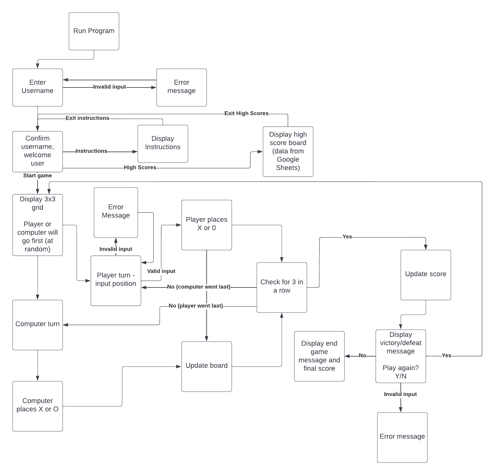

# Tic-Tac-Toe

Tic-Tac-Toe is a Python terminal game, which runs in the Code Institute mock terminal on Heroku. 

Users can play tic-tac-toe against a computer. The objective of the game is to place 3 Xs or 3 Os in a row on a 3x3 grid. Every time a new game starts, the first player is randomly determined (either the human user or the computer).

Users can also view a high score board to see how they compare to other players. Each win counts as one point on the score board. 

## Flowchart
I created a flowchart to determine the logic of the game before starting to code. This allowed me to visualize the steps the user and computer each need to complete as they progress through the game.

This also helped with planning input validation, and the options presented to the user when the program is initalized (play game, view instructions, and view the high score board).

## Features 

In this section, you should go over the different parts of your project, and describe each in a sentence or so. You will need to explain what value each of the features provides for the user, focusing on who this website is for, what it is that they want to achieve and how your project is the best way to help them achieve these things.

### Existing Features

### Features Left to Implement

## Testing 

In this section, you need to convince the assessor that you have conducted enough testing to legitimately believe that the site works well. Essentially, in this part you will want to go over all of your project’s features and ensure that they all work as intended, with the project providing an easy and straightforward way for the users to achieve their goals.

In addition, you should mention in this section how your project looks and works on different browsers and screen sizes.

You should also mention in this section any interesting bugs or problems you discovered during your testing, even if you haven't addressed them yet.

If this section grows too long, you may want to split it off into a separate file and link to it from here.

### Validator Testing 

### Unfixed Bugs

You will need to mention unfixed bugs and why they were not fixed. This section should include shortcomings of the frameworks or technologies used. Although time can be a big variable to consider, paucity of time and difficulty understanding implementation is not a valid reason to leave bugs unfixed. 

## Deployment

This section should describe the process you went through to deploy the project to a hosting platform (e.g. GitHub) 

- The site was deployed to GitHub pages. The steps to deploy are as follows: 
  - In the GitHub repository, navigate to the Settings tab 
  - From the source section drop-down menu, select the Master Branch
  - Once the master branch has been selected, the page will be automatically refreshed with a detailed ribbon display to indicate the successful deployment. 

The live link can be found here - https://code-institute-org.github.io/love-running-2.0/index.html 

## Credits 

In this section you need to reference where you got your content, media and extra help from. It is common practice to use code from other repositories and tutorials, however, it is important to be very specific about these sources to avoid plagiarism. 

You can break the credits section up into Content and Media, depending on what you have included in your project. 

### Content 
-[Tech with Tim](https://www.youtube.com/watch?v=u51Zjlnui4Y)'s Colorama tutorial was used to install & use Colorama, to change text colour in the terminal.
-[This article](https://www.uxmatters.com/mt/archives/2007/01/applying-color-theory-to-digital-displays.php) on UX Matters was used to confirm which colours are best for accessibility on a black background. This helped me choose a bright cyan as my welcome message colour.
- The Tabulate library was used to display the high score board data in a table. [DelftStack](https://www.delftstack.com/howto/python/data-in-table-format-python/) introduced me to the tabulate library, and I used [PyPi](https://pypi.org/project/tabulate/) for help on how to install it.

### Media
-[Patorjk.com](https://patorjk.com/) was used to create the "Tic-Tac-Toe" ASCII lettering in the welcome message.

Congratulations on completing your Readme, you have made another big stride in the direction of being a developer! 

## Other General Project Advice

Below you will find a couple of extra tips that may be helpful when completing your project. Remember that each of these projects will become part of your final portfolio so it’s important to allow enough time to showcase your best work! 

- One of the most basic elements of keeping a healthy commit history is with the commit message. When getting started with your project, read through [this article](https://chris.beams.io/posts/git-commit/) by Chris Beams on How to Write  a Git Commit Message 
  - Make sure to keep the messages in the imperative mood 

- When naming the files in your project directory, make sure to consider meaningful naming of files, point to specific names and sections of content.
  - For example, instead of naming an image used ‘image1.png’ consider naming it ‘landing_page_img.png’. This will ensure that there are clear file paths kept. 

- Do some extra research on good and bad coding practices, there are a handful of useful articles to read, consider reviewing the following list when getting started:
  - [Writing Your Best Code](https://learn.shayhowe.com/html-css/writing-your-best-code/)
  - [HTML & CSS Coding Best Practices](https://medium.com/@inceptiondj.info/html-css-coding-best-practice-fadb9870a00f)
  - [Google HTML/CSS Style Guide](https://google.github.io/styleguide/htmlcssguide.html#General)

Getting started with your Portfolio Projects can be daunting, planning your project can make it a lot easier to tackle, take small steps to reach the final outcome and enjoy the process! 