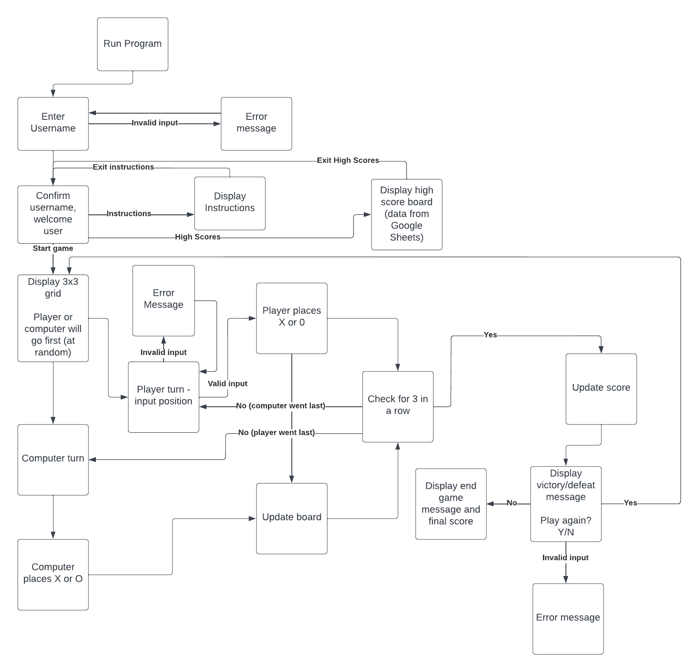
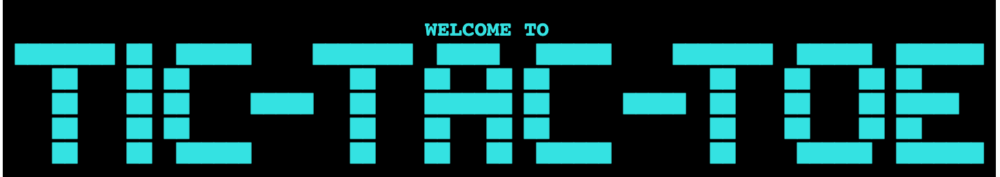
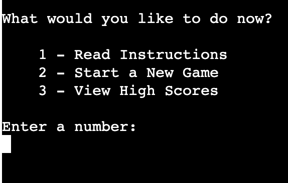
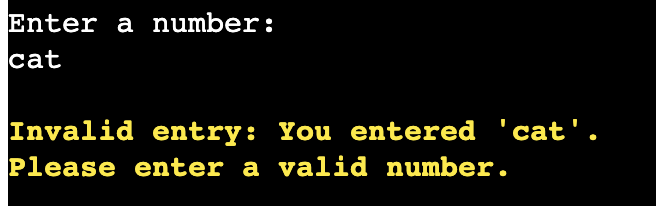
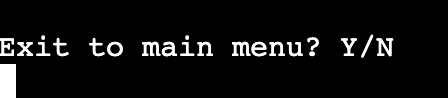
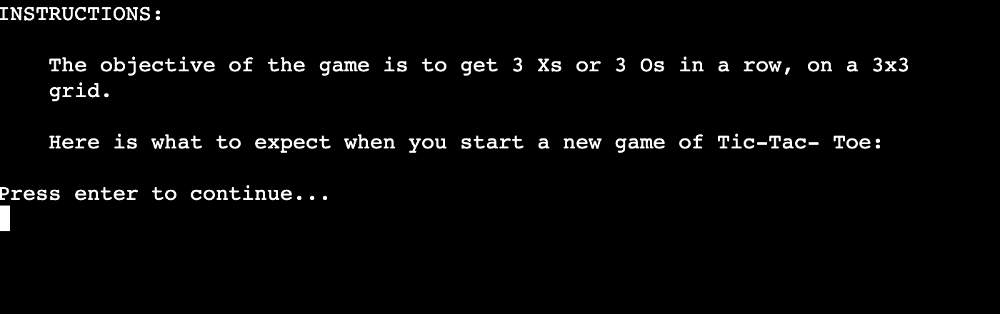
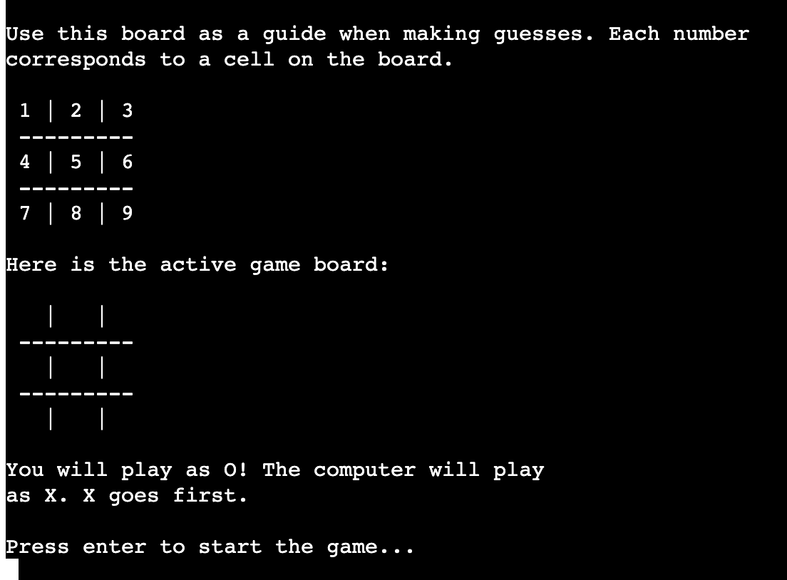

# Tic-Tac-Toe

Tic-Tac-Toe is a Python terminal game, which runs in the Code Institute mock terminal on Heroku. 

Users can play tic-tac-toe against a computer. The objective of the game is to place 3 Xs or 3 Os in a row on a 3x3 grid. Every time a new game starts, the first player is randomly determined (either the human user or the computer).

Users can also view a high score board to see how they compare to other players. Each win counts as one point on the score board. 

For more information on the game of Tic-Tac-Toe, see [Wikipedia](https://en.wikipedia.org/wiki/Tic-tac-toe).

## Flowchart
I created a flowchart to determine the logic of the game before starting to code. This allowed me to visualize the steps the user and computer each need to complete as they progress through the game.

This also helped with planning input validation, and the options presented to the user when the program is initalized (play game, view instructions, and view the high score board).


## User Stories

  -   #### First Time Visitor Goals

      1. As a First Time Visitor, I want to understand how to play Tic-Tac-Toe.
      2. As a First Time Visitor, I want to understand how to navigate the program to find the instructions, the high score board, and how to start a new game.
      3. As a First Time Visitor, I want to understand why I receive error messages and how to resolve them.
      4. As a First Time Visitor, I want to easily start a new game and play Tic-Tac-Toe against the computer.

  -   #### Returning Visitor Goals

      1. As a Returning Visitor, I want to view the high score board to see what has changed since I last played.
      2. As a Returning Visitor, I want to start a new round of Tic-Tac-Toe games against the computer, so I can update my own high score.
      3. As a Returning Visitor, I want my high scores to be associated with the same username. 

  -   #### Frequent User Goals
      1. As a Frequent User, I want to see my previous scores on the high score board. 

## Features

### Existing Features

- __Header__
    - The header serves as a welcome message, and appears at the top of the terminal throughout gameplay and across menu screens. I used cyan to make the header stand out and be visually appealing, and also because cyan is accessible to colourblind players on a black background.

    


- __Main Menu__
    - The main menu appears when the program is run, and the player has the option to return to the main menu from different screens throughout the program. There is a validation function in place to ensure the player selects a valid option between the numbers 1 - 3.
    
    

- __Error Messages__
    - Any time there is free text user input (i.e. anything other than "press enter"), there is a function to validate the input. If a user enters an invalid selection, they will see a yellow error message explaining what has gone wrong, and prompting them to try again. I chose yellow so it would stand out visually, and because yellow on black is an accessible colour combination for colourblindness.

    

- __Exit Message__
    - At the bottom of the instruction and high score board screens, and when gameplay is over, the user has the option to exit to the main menu. This makes navigation easy between the different screens of my program.

    

- __Instructions__
    - The instructions screen loads in two parts (prompting the user to press enter) so they do not have to scroll up after the full page has loaded. It begins with a brief description of the objective of the game, and when the user presses enter, it displays a step-by-step walkthrough of how to play the game.

    

- __Gameplay__
    - When the game starts, the user is presented with 3 things:
        1) a sample board, with each cell numbered 1 through 9, so the user understands which number corresponds with which cell;
        2) the active game board, which is blank when the game starts, and is updated as the player and computer make moves;
        3) a message confirming which symbol they will play (X or O), which symbol the computer will play, and who will go first. 
    This makes it easy for the player to understand how to play, and who will make the first move. They are prompted to press enter to start the game when they have finished reading.

    

### Data Structures

A class for the game board:
```python
class Board():
    """
    Main game board class. This sets the board size, and has methods for
    adding guesses and printing the board. Some of the code used here was
    modified from TokyoEdtech's Youtube tutorial (credit in README).
    """

    def __init__(self):
        self.cells = [" ", " ", " ", " ", " ", " ", " ", " ", " "]

    def display(self):
        """
        Displays the game board, with numbers in each cell so the
        player knows which cell corresponds to which number when making
        guesses.
        """
        print("Here is the active game board:\n")
        print(f" {self.cells[0]} | {self.cells[1]} | {self.cells[2]} ")
        print(" ---------")
        print(f" {self.cells[3]} | {self.cells[4]} | {self.cells[5]} ")
        print(" ---------")
        print(f" {self.cells[6]} | {self.cells[7]} | {self.cells[8]} ")

    def update_cell(self, cell_no, player):
        """
        Updates a cell in the board with the player or computer's move (X or
        O).
        """
        self.cells[cell_no] = player
        return self.cells
  ```

  The Board class serves two major functions: 
  - 1) to display the game board, with a value assigned to each bank cell in the board. 
  - 2) to update the game board every time the computer or player makes a move, using a function that changes the value of the chosen cell. This cross-references the cell number that the player chose, and updates it with the symbol (X or O) that has been assigned to that player.

  A class for the player:
  ```python
  class Player():
    """
    Player class. This determines whether the player or computer is playing
    Xs or Os.
    """

    def __init__(self, playing_as):
        self.playing_as = playing_as
  ```

  This allows the program to randomly assign "X" or "O" to either the human player or the computer player, both instances of the player class. 

### Features Left to Implement

  - The option to play against another human opponent in person. Right now, the only option is to play against the computer, and the program will randomly decide who goes first. In the future there will be the option for two players to play against each other, with the option to choose who goes first.

  - A password so that the user can log in to their own account, with a unique username. As it is, the program will allow multiple users to use the same username, which could result in two different scores being attributed to the same username on the high score board, but which might represent two different players. Implementing a login system with a unique username & password would prevent this, but this was outside the scope of this project.

### Refactoring

- During development, there was opportunity to refactor the `is_winner()` function. This was the original function: 
```python
def is_winner(self, player):
        """
        Read the board to determine when there is a winner (3 of the same
        symbol in a row).
        """
        if (self.cells[0] == player and self.cells[1] == player and
                self.cells[2] == player):
            return True
        if (self.cells[3] == player and self.cells[4] == player and
                self.cells[5] == player):
            return True
        if (self.cells[6] == player and self.cells[7] == player and
                self.cells[8] == player):
            return True
        if (self.cells[0] == player and self.cells[3] == player and
                self.cells[6] == player):
            return True
        if (self.cells[1] == player and self.cells[4] == player and
                self.cells[7] == player):
            return True
        if (self.cells[2] == player and self.cells[5] == player and
                self.cells[8] == player):
            return True
        if (self.cells[0] == player and self.cells[4] == player and
                self.cells[8] == player):
            return True
        if (self.cells[2] == player and self.cells[4] == player and
                self.cells[6] == player):
            return True
```

This was refactored using list comprehension and slicing:

```python
        if all(cell == player for cell in self.cells[0:3]):
            return True
        if all(cell == player for cell in self.cells[3:6]):
            return True
        if all(cell == player for cell in self.cells[6:9]):
            return True
        if all(cell == player for cell in self.cells[0:7:3]):
            return True
        if all(cell == player for cell in self.cells[1:8:3]):
            return True
        if all(cell == player for cell in self.cells[2:9:3]):
            return True
        if all(cell == player for cell in self.cells[0:9:4]):
            return True
        if all(cell == player for cell in self.cells[2:7:2]):
            return True
```

This was then further refactored using list comprehension:

```python
 wins = [
            [0, 1, 2], [3, 4, 5], [6, 7, 8], [0, 3, 6], [1, 4, 7],
            [2, 5, 8], [0, 4, 8], [2, 4, 6]
            ]
        for win in wins:
            if (self.cells[win[0]] == player and self.cells[win[1]] == player
               and self.cells[win[2]] == player):
                return True
```

## Testing 

Please see the [Testing file](TESTING.md) for manual & validator testing.

## Deployment
​
Code Institute has provided a [template](https://github.com/Code-Institute-Org/python-essentials-template) to display the terminal view of this backend application in a modern web browser. This is to improve the accessibility of the project to others.
​
The live deployed application can be found at [tic-tac-toe-steph](https://tic-tac-toe-steph.herokuapp.com/).
​
### Local Deployment
​
*Gitpod* IDE was used to write the code for this project.
​
To make a local copy of this repository, you can clone the project by typing the follow into your IDE terminal:
- `git clone https://github.com/StephHjar/tic-tac-toe.git`

Alternatively, if using Gitpod, you can click below to create your own workspace using this repository.

[](https://gitpod.io/#https://github.com/StephHjar/tic-tac-toe)
​
### Heroku Deployment
​
This project uses [Heroku](https://www.heroku.com), a platform as a service (PaaS) that enables developers to build, run, and operate applications entirely in the cloud.
​
Deployment steps are as follows, after account setup:
​
- Select *New* in the top-right corner of your Heroku Dashboard, and select *Create new app* from the dropdown menu.
- Your app name must be unique, and then choose a region closest to you (EU or USA), and finally, select *Create App*.
- From the new app *Settings*, click *Reveal Config Vars*, and set the value of KEY to `PORT`, and the value to `8000` then select *add*.
- Now, add a seecond Config Var for the creds.json file, which contains the API Key from Google Sheets. Set the value of KEY to `CREDS` and paste the entire contents of creds.json in the VALUE box. Select *add*.
- Further down, to support dependencies, select *Add Buildpack*.
- The order of the buildpacks is important, select `Python` first, then `Node.js` second. (if they are not in this order, you can drag them to rearrange them)
​
Heroku needs two additional files in order to deploy properly.
- requirements.txt
- Procfile
​
You can install this project's requirements (where applicable) using: `pip3 install -r requirements.txt`. If you have your own packages that have been installed, then the requirements file needs updated using: `pip3 freeze --local > requirements.txt`

The Procfile can be created with the following command: `echo web: node index.js > Procfile`

For Heroku deployment, follow these steps to connect your GitHub repository to the newly created app:
​
- In the Terminal/CLI, connect to Heroku using this command: `heroku login -i`
- Set the remote for Heroku: `heroku git:remote -a <app_name>` (replace app_name with your app, without the angle-brackets)
- After performing the standard Git `add`, `commit`, and `push` to GitHub, you can now type: `git push heroku main`

The frontend terminal should now be connected and deployed to Heroku.


## Credits 

### Media
- [Patorjk.com](https://patorjk.com/) was used to create the "Tic-Tac-Toe" ASCII lettering in the welcome message.
- [Am I Responsive?](https://ui.dev/amiresponsive) was used to demonstrate the responsiveness of the site / program.

### Content 
- I used Code Institute's Love Sandwiches Walkthrough ([final code here:](https://github.com/Code-Institute-Solutions/love-sandwiches-p5-sourcecode/tree/master/05-deployment/01-deployment-part-1)) for guidance with code structure, linking my program to Google Sheets using an API, and deployment steps.
- [Tech with Tim](https://www.youtube.com/watch?v=u51Zjlnui4Y)'s Colorama tutorial was used to install & use Colorama, to change text colour in the terminal.
- [This article](https://www.uxmatters.com/mt/archives/2007/01/applying-color-theory-to-digital-displays.php) on UX Matters was used to confirm which colours are best for accessibility on a black background. This helped me choose a bright cyan as my welcome message colour and yellow for my error messages.
- The 'clear' function is from [this post](https://stackoverflow.com/questions/2084508/clear-terminal-in-python) on StackOverflow.
- The Tabulate library was used to display the high score board data in a table. [DelftStack](https://www.delftstack.com/howto/python/data-in-table-format-python/) introduced me to the tabulate library, and I used [PyPi](https://pypi.org/project/tabulate/) for help on how to install it.
- [This page](https://www.extendoffice.com/documents/excel/5170-google-sheets-automatically-sort-alphabetically.html) on ExtendOffice was used to look up how to sort a Google Sheet automatically (when new scores are added to the sheet, this automatically sorts them from highest to lowest).
- I used [this page](https://www.guru99.com/python-time-sleep-delay.html) on Guru99 for instructions on how to import and use the time module.
- [TokyoEdtech's Tic-Tac-Toe Tutorial](https://www.youtube.com/watch?v=7Djh-Cbgi0E) on Youtube helped give me ideas for how to display the Board class (in Part 1 of the video series) and how to determine a winner (Part 3 of the video series). Code from these videos was used and modified in the Board class and in the `check_result` function.
- [This question on StackOverflow](https://stackoverflow.com/questions/41906978/python-randomly-choose-a-spot-on-a-tic-tac-toe-board) helped me understand how to use the random method to assign X or O to the player randomly, and select a random cell for the computer to play each turn.
- I used [this question on StackOverflow](https://stackoverflow.com/questions/48266880/python-generate-random-integer-that-is-not-in-a-list) to have the computer only guess a cell that had not already been guessed (and would therefore be present in the 'guesses' list).
- I used code from [this page on PythonTutorial.net](https://www.pythontutorial.net/python-basics/python-sort-list/#:~:text=Summary-,Use%20the%20Python%20List%20sort()%20method%20to%20sort%20a,reverse%20the%20default%20sort%20order.) to sort the high score list by score. Specifically, the 'Using the Python List sort() method to sort a list of tuples' section of this page.
- I used Method #1 Using `all()` on [GeeksforGeeks](https://www.geeksforgeeks.org/python-check-if-all-elements-in-list-follow-a-condition/) to check if all elements in a list are equal to X or O, in the `is_winner()` function.
- Thank you to my mentor for this project, Tim Nelson, for support and guidance throughout - and for the deployment steps I used in my README!

