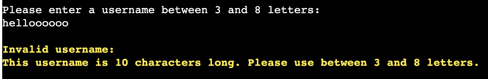

## Testing 

### Manual Testing
The program was tested manually by going through all possible error validation messages, all possible game results (player win, computer win, draw), and the functionality of writing to the high score board. See the results below:

| Test Case | Pass? | Screenshot |
|-----------|-------|------------|
|Main menu options: enter a space|Yes||
|Main menu options: enter a letter|Yes||
|Main menu options: enter a special character|Yes||
|Main menu options: enter a number not between 1-3|Yes||
|Exit options: enter a space|Yes||
|Exit options: enter a letter other than Y or N|Yes||
|Exit options: enter a special character|Yes||
|Exit options: enter a number|Yes||
|Gameplay options: enter a space|Yes||
|Gameplay options: enter a letter|Yes||
|Gameplay options: enter a special character|Yes||
|Gameplay options: enter a number not between 1-9|Yes||
|Gameplay options: enter a number of an occupied cell|Yes||
|Gameplay: computer win|Yes|
|Gameplay: player win|Yes|
|Gameplay: draw|Yes|
|New game options: enter a space|Yes||
|New game options: enter a letter other than Y or N|Yes||
|New game options: enter a special character|Yes||
|New game options: enter a number|Yes||
|High score options: enter a space|Yes||
|High score options: enter a letter other than Y or N|Yes||
|High score options: enter a special character|Yes||
|High score options: enter a number|Yes||
|Username entry: enter a space|Yes||
|Username entry: enter a special character|Yes||
|Username entry: enter a number|Yes||
|Username entry: less than 3 letters|Yes||
|Username entry: more than 8 letters|Yes||
|Confirm writing to high score board|Yes||
|Update Google Sheet|Yes|

Please see the [Closed Issues tab on GitHub](https://github.com/StephHjar/tic-tac-toe/issues?q=is%3Aissue+is%3Aclosed) for a list of all resolved bugs.

### Validator Testing 
Code was passed through the [PEP8 online linter](http://pep8online.com/). On the initial run, one issue was found, a line break before a binary operator:

I adjusted the line spacing in the function, and no errors were found on a second pass:

After making some changes to the code (spacing/indentation), a third pass also came back with no issues:

### Unfixed Bugs

- Due to limitations in Code Institute's Heroku template, which was used for deployment, this site is *not* fully responsive. The terminal cannot receive input from a mobile keyboard, and does not resize based on window size. Making the application fully responsive was beyond the scope of this project. This shows responsiveness during various stages of gameplay: 

- Similarly, due to limitations in the Heroku template, the `clear()` function only clears the visible part of the terminal. 
This is not disruptive to the player, as the visible area is always cleared. Everything the user needs to interact with is contained on one screen, so the user has no reason to scroll up within the terminal. 
However, if they do scroll up after having navigated through different screens, they will see the parts of the previous screen that were not cleared (i.e. anything that was outside the visible section of the terminal when the `clear()` function was called). Because this is only a limitation in the deployed terminal, and not an issue when the program is run in the command line, this remains unresolved at this time. See an example below: 

